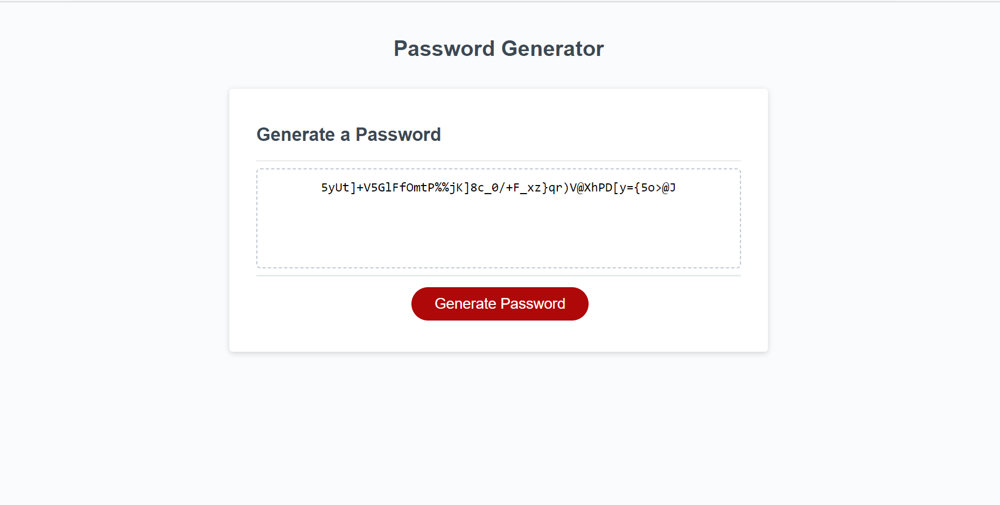

# Password Generator

## Descriptions 
This application generates a random secure password that based on the criteria selected by an employee.

## URL
https://oriarh.github.io/Module-3-challenge/

## Screenshot

## Installation
N/A

## Usage
When you open this web app, you see a simple user interface. When you click on the generate password button,
you will be presented with a series of prompts to choose the criteria such as length.

This web app was built using HTML and CSS & Javascript.

## Credits
UC Berkeley Extension Instructional Staff

## License
MIT License
